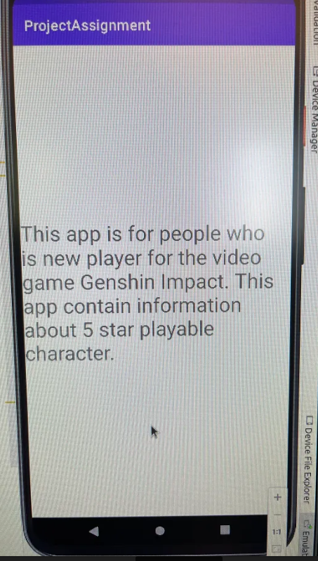

# ProjectAssignment

## Skiss/design-idé

Bild 1  Skiss for main screen <br>


Bild 2  Skiss for about screen <br>


Skiss based on project requirements.

## Webbtjänst - JSON

An example object from Data.java
```
  public String toString() {
        return name+" from "+location+" who has "+ category+" vison is "+ auxdata +".";
    }
```
My app is about the video game Genshin Impact. It will show information about playable character in game. <br>
name-there are different characters name. <br>
location-there have different area in game. So location means which area the character if from.  <br>
category-there have vison in game which cam make character use element power.  <br>
auxdata- Here is the information about character's background. Who are they in game. <br>
size- Here add I about character's height, but that's not used in the end.

## Implementation Example

##### Example 1  Main Activity
 
Bild 3  App Main Screen <br>


At top of screenshot is the tittle of the app. Nothing special just a text view with tittle at activity_main.xml.

At the mid of screenshot is the recycler view of the app. This is the most important part of this app.

Code 1 Code about Recycler View at Main Activity
```
 protected void onCreate(Bundle savedInstanceState) {
        data = new ArrayList<>();
        recyclerView = findViewById(R.id.recycler_view);
        dataAdapter = new DataAdapter(data);
        recyclerView.setAdapter(dataAdapter);
        recyclerView.setLayoutManager(new LinearLayoutManager(getApplicationContext()));

        new JsonTask(this).execute(JSON_URL);
    }   
        public void onPostExecute(String json) {
        Gson gson = new Gson();
        Type type = new TypeToken<List<Data>>() {}.getType();
        List<Data> listOfData = gson.fromJson(json, type);

        for (int i = 0; i < listOfData.size(); i++) {
            data.add(listOfData.get(i));
        }

        dataAdapter.notifyDataSetChanged();
    }

```
These code is about how to get the data and show it on the main activity. <br>
Code in the OnCreate function is used to set adapter and layout manager to the recycler view.   <br>
Code in the onPostExecute function is used to get data and add data to adapter. <br>
To get data from internet and show it in right place. It also need the help of file Data.java, DataAdapter.java and JsonTask.java. <br>

At bottom of screenshot is the button to start about activity.

[When start coding about the recycler view, click to see](https://github.com/a19xinhu/ProjectAssignment/commit/3158417530bc65ed9644d994793c24354de9286a)

##### Example 2  About Activity

Code 2 Code about Button at Main Activity
```
    protected void onCreate(Bundle savedInstanceState) {
        button = findViewById(R.id.button);
        button.setOnClickListener(new View.OnClickListener() {
            @Override
            public void onClick(View view) {
                onButtonClick();
            }
        });
    } 
      
    private void onButtonClick(){
        Intent intent = new Intent(this,AboutActivity.class);
        startActivity(intent);
    }
```
Code above is used to start the About Activity in this app.

Bild 4  App About Screen <br>
  <br>
And at About Screen, just a textview with text in it.

[When done coding about activity, click to see](https://github.com/a19xinhu/ProjectAssignment/commit/066b45733a5535d14cd0968f5fcd32be56154331)

## Reflektion

I think this project assignment is not difficult. Use all we learned from lesson in this can solve it.  <br>
When i codeing this app, i get 2 problems about recycler view and one about second activity. <br>
Problem 1 <br>
Recycler view i write the code like we did at the lesson but it do not work.  <br>
Gson, it need to add from Project Structure first. Then you can use it. <br>
Problem 2 <br>
After Gson is usable. The Data show in the screen but it only show 1 object. Cost me lots of time to figure it out. <br>
It just need to change layout_height at List_item. And it will show 5 object. <br>
Problem 3 <br>
Done with main activity and about activity. When I try to start About activity when i click button, app stopped. <br>
Finally i remembered to add about activity into the AndroidManifest.xml. <br>
This project assignment is a good exercise for what we have learned.
